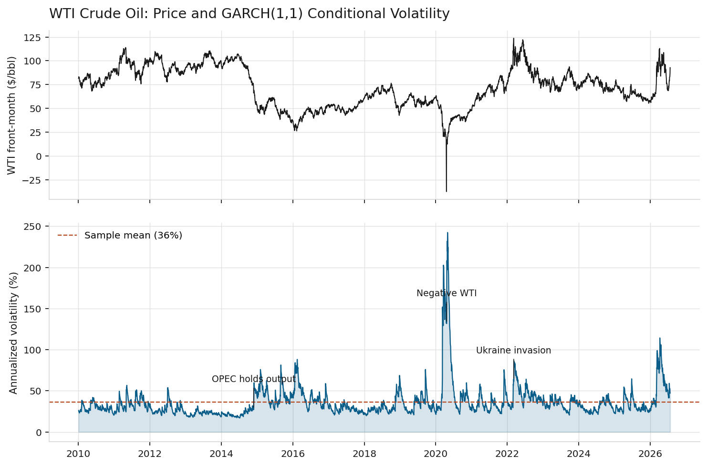
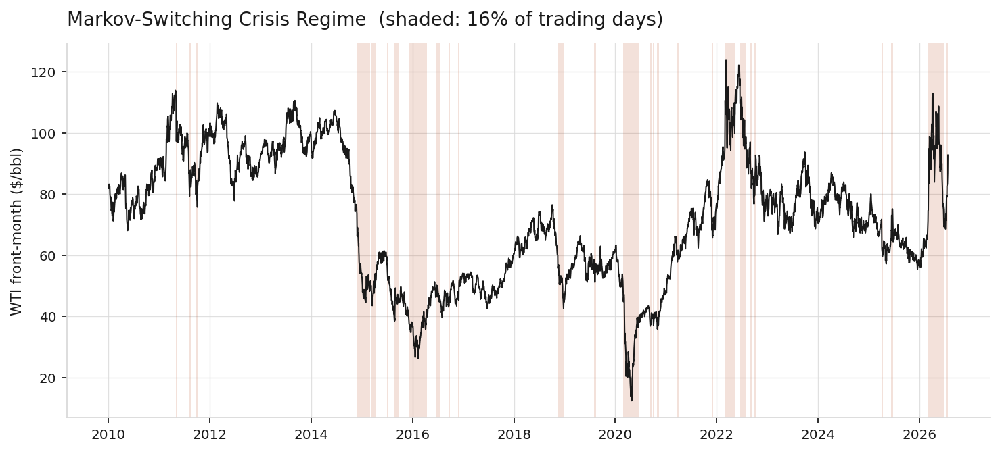
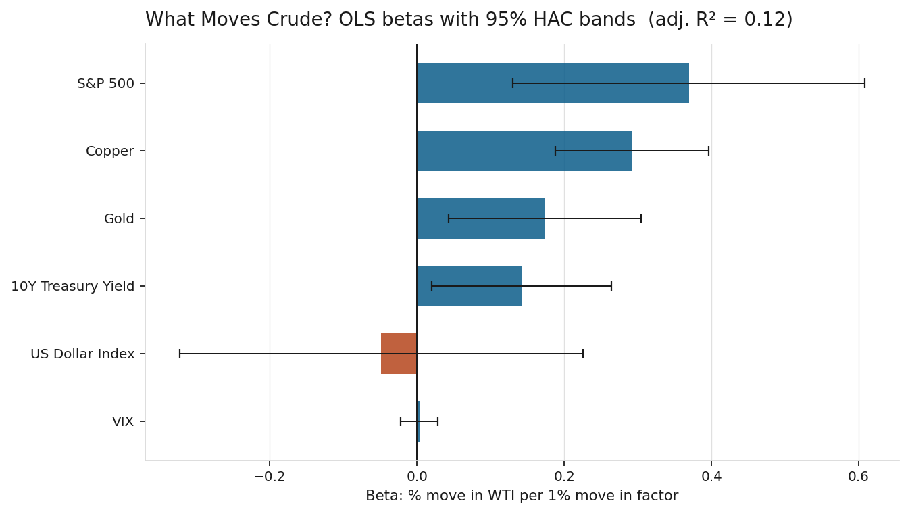
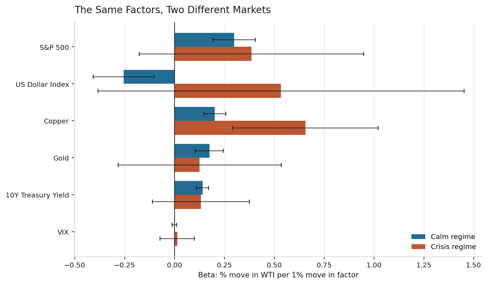

# Commodity Volatility & Macro Model

Modeling the volatility of WTI crude oil futures, and testing which macro factors actually move crude returns — versus which only appear to until you condition on the volatility regime.

**Stack:** Python · pandas · statsmodels · arch · yfinance · Matplotlib
**Sample:** 4,166 trading days, January 2010 – July 2026 (WTI front-month, `CL=F`)

**The finding in one line:** the dollar–crude relationship that everyone quotes is a calm-market phenomenon. It is strong and highly significant when volatility is low, and it disappears — sign flip included — exactly when oil starts moving.

---

## 1. Volatility

Crude returns are fitted with a GARCH(1,1) using Student-t errors. Normality badly understates how often oil moves several standard deviations; the sample kurtosis of 27.8 makes that concrete.



| Statistic | Value |
|---|---|
| Persistence (α + β) | **0.986** |
| Shock half-life | **~50 trading days** |
| Mean annualized volatility | **36.1%** |
| Latest annualized volatility | **47.2%** |

The headline is persistence. At α + β = 0.986 the process sits just below the non-stationary boundary: a volatility shock takes roughly ten weeks to decay halfway back to its long-run level. Crude does not calm down quickly, which is why 2014, April 2020, and the 2022 invasion each appear as a plateau rather than a spike.

## 2. Regimes

Rather than splitting the sample at an arbitrary volatility threshold, the regimes are estimated with a two-state Markov-switching model with regime-dependent variance. The data decides how many days are genuinely stressed and how sticky each state is.



| | Calm | Crisis |
|---|---|---|
| Share of sample | 84.2% | **15.8%** |
| Annualized volatility | 27.0% | **82.0%** |
| Expected duration | 75 days | 15 days |
| Transition persistence | 0.987 | 0.934 |

The model is not told what a crisis is, and it recovers the episodes an energy trader would name unprompted: the November 2014 OPEC decision (62 days), the 2015–16 collapse (91 days), COVID (78 days, spanning the negative-price print), the 2022 invasion (55 days) — and an ongoing regime that began in late February 2026. Variance in the crisis state runs roughly nine times the calm state.

## 3. What actually moves crude?

Daily WTI log returns regressed on contemporaneous macro factor returns, OLS with Newey-West (HAC, 5 lags) standard errors. Full sample first, adjusted R² = 0.119:



| Factor | Beta | p-value |
|---|---|---|
| S&P 500 | +0.37 | 0.002 |
| Copper | +0.29 | 0.000 |
| Gold | +0.17 | 0.009 |
| 10Y Treasury yield | +0.14 | 0.023 |
| US Dollar Index | −0.05 | 0.729 |
| VIX | +0.00 | 0.811 |

On the full sample the dollar is statistically indistinguishable from zero. Taken at face value that says the dollar doesn't matter for oil — which contradicts both theory and most desk intuition.

It's an artifact of pooling.

## 4. The same factors, two different markets

Re-estimating the betas within each Markov regime:



| Factor | Calm regime | Crisis regime |
|---|---|---|
| US Dollar Index | **−0.26** (p = 0.001) | +0.53 (p = 0.25) |
| S&P 500 | +0.30 (p = 0.000) | +0.39 (p = 0.18) |
| Gold | +0.18 (p = 0.000) | +0.13 (p = 0.55) |
| 10Y Treasury yield | +0.14 (p = 0.000) | +0.13 (p = 0.29) |
| VIX | −0.00 (p = 0.93) | +0.01 (p = 0.76) |
| Copper | +0.20 (p = 0.000) | **+0.66** (p = 0.000) |
| Adjusted R² | 0.155 | 0.108 |

Three results worth stating plainly:

**1. The dollar effect is real, and it is conditional.** In calm markets the beta is −0.26 with a p-value of 0.001 — the textbook relationship, cleanly identified. In crisis it flips positive and loses significance. The insignificant full-sample estimate isn't evidence of no relationship; it's two opposite regimes cancelling.

**2. In a crisis, crude decouples from finance.** Every financial factor — equities, gold, rates, VIX — is significant in the calm state and insignificant in the crisis state. Whatever the pooled regression suggests these factors do, they stop doing it precisely when it would matter.

**3. Physical demand is the only survivor, and it strengthens.** Copper is significant in both regimes and its beta more than triples, from +0.20 to +0.66. When oil is volatile it trades on the industrial demand story, not the financial one.

Explanatory power falls from 0.155 to 0.108 in the crisis regime. Exactly when a risk model is most needed, this factor set explains least of what crude is doing — which is itself the useful takeaway.

---

## Running it

```bash
pip install -r requirements.txt
python commodity_vol_macro.py
```

Writes four charts to `charts/` and full model summaries to `results/`. Data comes from Yahoo Finance — free, no API key. `notebook.ipynb` walks through the same analysis interactively.

## Method notes & limitations

- **Contemporaneous, not causal.** Every regressor is same-day. This decomposes comovement; it does not identify causation and it is not a forecast.
- **Regime assignment uses smoothed probabilities**, which condition on the full sample. Appropriate for describing history, but a real-time system would need filtered probabilities — the smoothed version knows the future.
- **Front-month futures** carry roll effects. A continuous back-adjusted series would be more rigorous.
- **Small crisis sample.** 657 observations across 36 episodes, so the wide crisis-regime confidence intervals are honest about what can be identified from stress periods.
- **HAC standard errors** handle autocorrelation and heteroskedasticity, but residual kurtosis of 27.8 means tail inference deserves caution.
